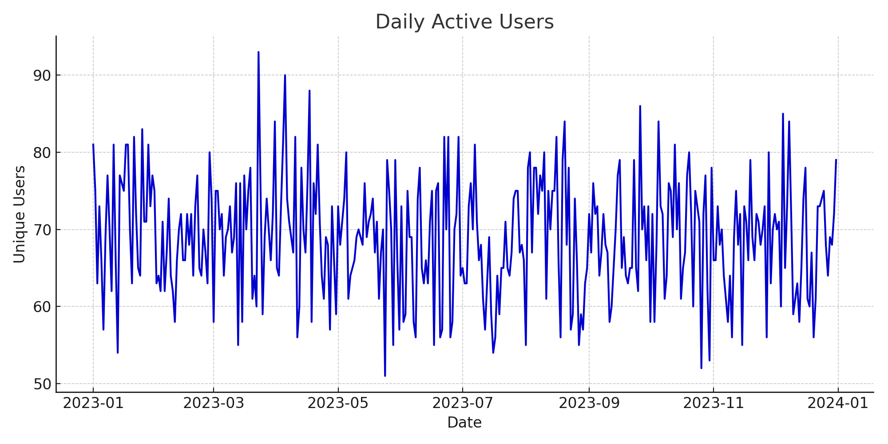
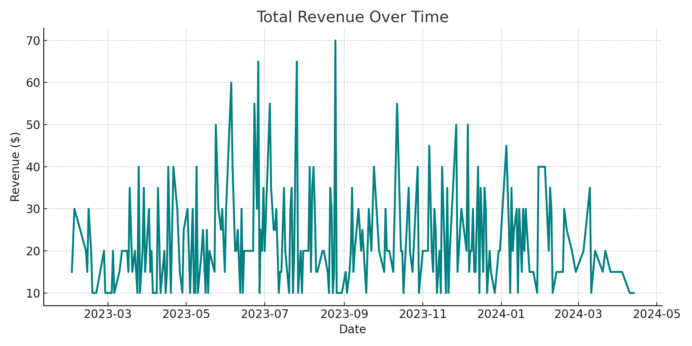
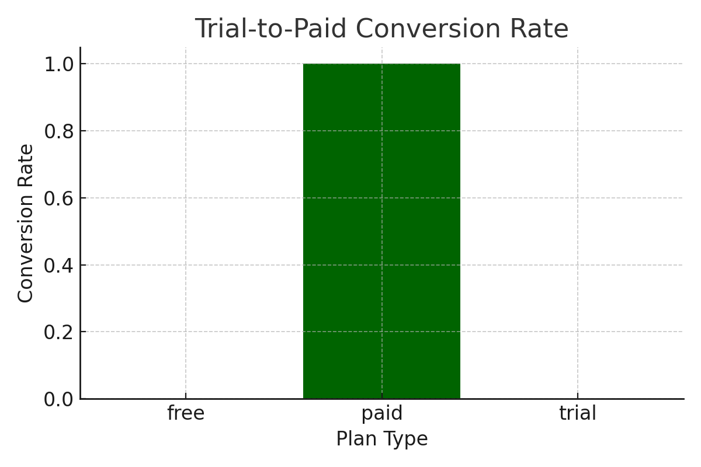

# 📊 PulseGrow Analytics Platform



Welcome to **PulseGrow**, an end-to-end growth analytics platform designed to showcase your ability to:

✅ Lead strategic product analytics  
✅ Build predictive models for churn, retention, and monetization  
✅ Create live dashboards and insight pipelines  
✅ Conduct cohort analysis, forecasting, and experimentation

---

## 🚀 Live Demo

> 🔗 [Launch PulseGrow Dashboard on Streamlit](https://your-app-url.streamlit.app)  
*(replace with your deployed URL)*

---

## 🧠 Core Features

| Feature | Description |
|--------|-------------|
| 📈 **DAU Dashboard** | Track daily active users in real time |
| 💸 **Revenue Forecasting** | Predict revenue with Prophet |
| 🔁 **Trial Conversion Funnel** | Analyze trial-to-paid conversion rates |
| 📊 **Cohort Retention Matrix** | Track user engagement by signup cohort |
| 🧪 **A/B Testing Insights** | Interpret experiment outcomes |
| 🔍 **EDA Tools** | Generate summaries and plots interactively |

---

## 📸 Screenshots

### 🧍 Daily Active Users


### 💰 Revenue Over Time



### 🔁 Trial Conversion Funnel



---

## 🧠 How It Works

```
pulsegrow-analytics/
├── streamlit_app.py       # Main dashboard interface
├── models/                # Churn & revenue forecast models
├── scripts/               # KPI pipeline & cohort tools
├── utils/                 # EDA & data loading helpers
├── data/                  # Synthetic product engagement data
├── dashboards/images/     # Prebuilt visualizations
└── requirements.txt       # All needed dependencies
```

---

## 🛠 Technologies

- **Python** (Pandas, NumPy, scikit-learn)
- **Streamlit** (Interactive dashboard)
- **Prophet** (Forecasting)
- **GitHub** (Portfolio-hosted)
- **Matplotlib + Plotly** (Visualization)

---

## 💼 Use This Project To:

- Demonstrate product analytics skills 
- Walk through causal & propensity models in live demos
- Share modeling and dashboarding on GitHub

---

## 🙋 About the Author

**Matthew Leichter**  
[🌐 Portfolio](https://matthewleichter.github.io)  
📧 matthew.leichter@gmail.com  
📱 +1 (323) 303-8062  

---

> ✨ This project was generated with ❤️ using python and the Leprechaun Agentic Operating System(c) (2025 - Matthew Leichter) and deployed for real-world demonstration.

